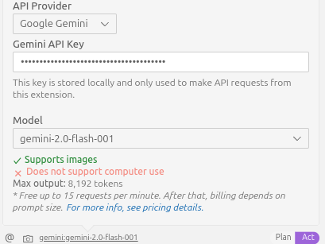
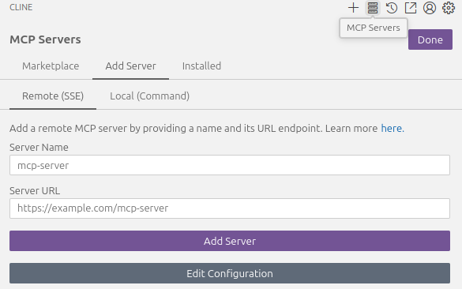
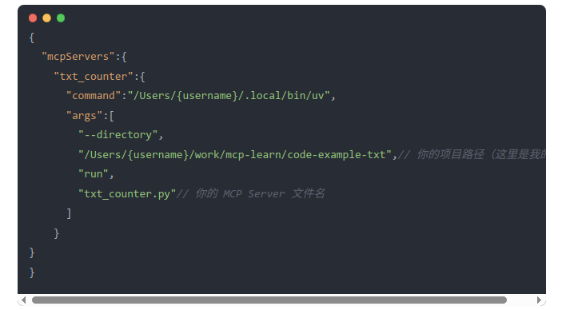
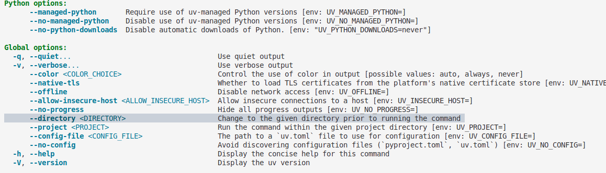
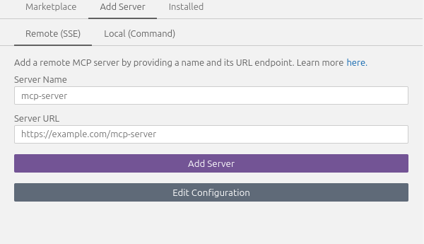

# mcp

这个是参考：
https://mp.weixin.qq.com/s/ULxokHOn4zVOgiLHf9DQUA,
https://zhuanlan.zhihu.com/p/20222456593

作出一些简单地补充，采用cline 当作client，可以选择gemini作为llm



文中似乎没有特意注明如何使用claude desktop。这里可以选择多种client作为和llm沟通的平台（就是一个界面，也可以自己写）

当前可以选择的client 在llms-full.txt 中有列出来

server 主要是用来生成工具的，工具正如/src/calculate.py，src/datawale.py中展示的，所以一般而言，我们需要定义的就是这个工具（有人进行了开源可以自行选择，比如：https://github.com/ahujasid/blender-mcp）

在这里主要展示如何使用client
vscode 中安装Cline 插件，选择合适的模型，如上图
然后选择 mcp servers ,installed ，edit configuration将配置文件添加进去即可




command 这里必须使用绝对路径，相对路径会出现错误
调用工具的时候，应该是类似与首先执行server 使其始终运行，以便之后进行通信调用
类似于：/Users/{username}/.local/bin/uv --directory /Users/{username}... run txt_counter.py
--directory 切换执行目录。


也可以直接运行txt_counter.py，但是需要自己修改端口


client（我没有尝试）
src/mcp_client.py
参考：https://github.com/modelcontextprotocol/python-sdk?tab=readme-ov-file#quickstart
实际上的作用就是类似于一个ui，目的就是和llm进行通信，获取response（比如需要调用的工具，可以参考langchain）

一些使用的简单示例
https://modelcontextprotocol.io/examples

prompts：的结构

有点类似与langchain bind_tools,但是功能更强大
https://modelcontextprotocol.io/docs/concepts/prompts#prompts

Prompts enable servers to define reusable prompt templates and workflows that clients can easily surface to users and LLMs. They provide a powerful way to standardize and share common LLM interactions.

Prompts are designed to be  **user-controlled** , meaning they are exposed from servers to clients with the intention of the user being able to explicitly select them for use.

```json
{
  name: string;              // Unique identifier for the prompt
  description?: string;      // Human-readable description
  arguments?: [              // Optional list of arguments
    {
      name: string;          // Argument identifier
      description?: string;  // Argument description
      required?: boolean;    // Whether argument is required
    }
  ]
}

```
